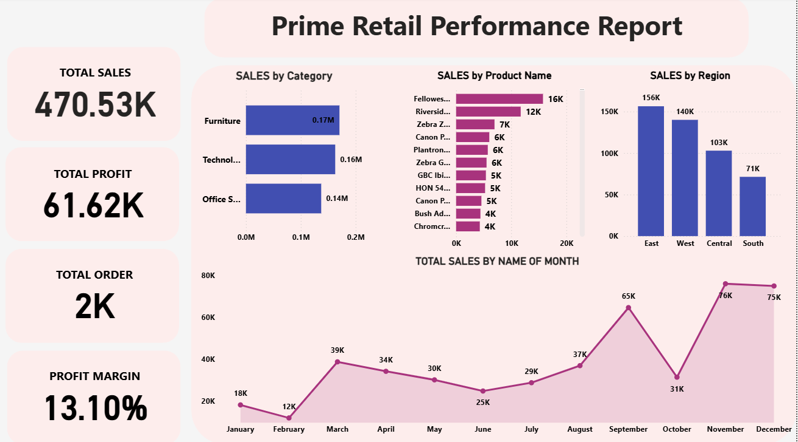

# PrimeRetail Sales Performance Dashboard

## Objective
To analyze and visualize the sales performance of PrimeRetail, providing key insights into total sales, profit, orders, and profit margin. The dashboard breaks down performance by product category, product name, and region to identify top sellers and key market areas.

## Tools Used
- **Power BI:** For data modeling, DAX calculations, and interactive visualizations.
- **Data Sources:** Likely a SQL database or flat files containing tables for Customers, Orders, Products, and Sales.

## Key Metrics Tracked
- **Total Sales:** $470.53K
- **Total Profit:** $61.62K
- **Total Orders:** 2,000
- **Profit Margin:** 13.10%

## Dashboard Features
- Interactive filters for drilling down into specific categories, products, or regions.
- Visual breakdown of sales by category and product name.
- Geographical analysis of sales by region.

## View Dashboard
[Click here to view the interactive Power BI dashboard]([PASTE YOUR POWER BI PUBLIC LINK HERE])

## Preview
 
